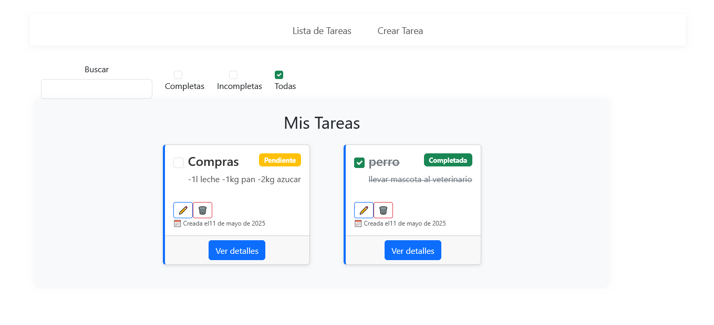
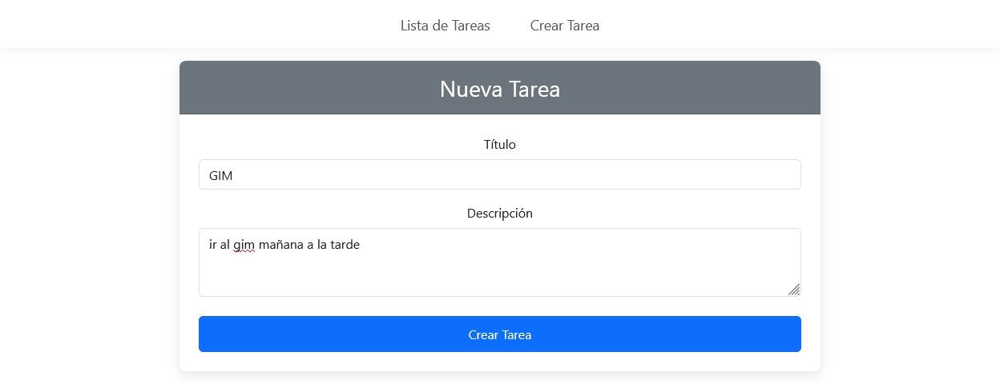
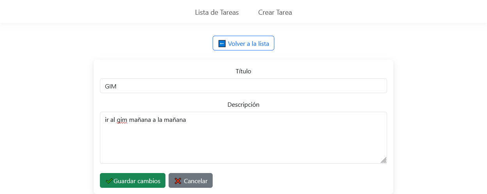
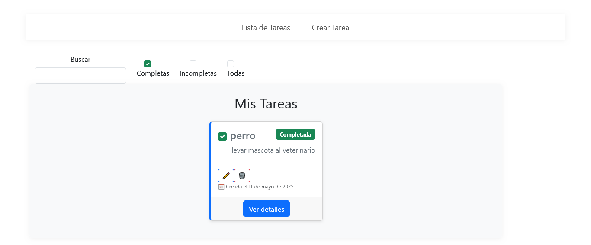

# 📝 TODO List App

Esta es una aplicación simple de lista de tareas (TODO List) desarrollada como parte de una prueba técnica. Permite crear, editar, eliminar y filtrar tareas según su estado.

## 🚀 Tecnologías

- Backend: Node.js con Express
- Frontend: React + Vite
- Base de datos: (utilicé SQLite ya que tengo una cuenta en Turso)

---

## ⚙️ Instrucciones para ejecutar en local
    
    1. Clonar el repositorio

git clone https://github.com/juancruz12345/ForIT-Prueba-Tecnica
cd [NOMBRE_DEL_REPO]

    2. Ejecutar Backend

    cd backend
    npm install
    node start

    3.Ejecuturar frontend

    cd frontend
    npm install
    npm run dev

## Capturas

        
        
        
        
        

